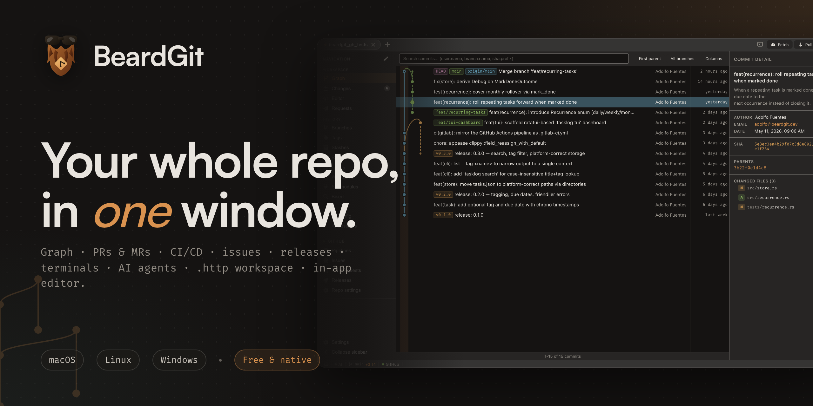
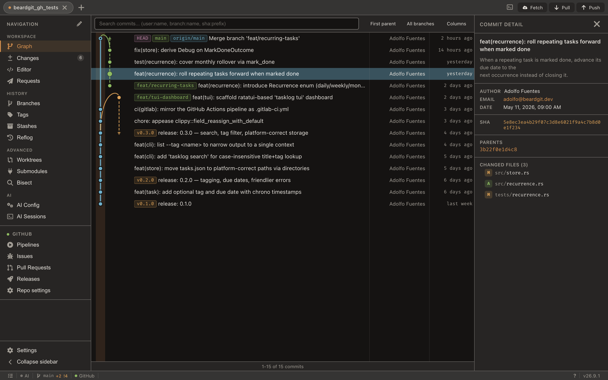

<p align="right">
  <a href="README.md">English</a> · <strong>Español</strong>
</p>

<p align="center">
  
</p>

<h1 align="center">BeardGit</h1>

<p align="center">
  <strong>Una ventana para todo tu repositorio.</strong>
  <br />
  El grafo, tus pull y merge requests, la CI, las issues, las releases, las terminales, las ejecuciones de AI, tus peticiones <code>.http</code> y un editor de ficheros — en la misma app de escritorio, para que subir un cambio deje de ser un recorrido por cuatro de ellas.
  <br />
  Hecho con Tauri, no con Electron. Sin cuenta y sin telemetría. macOS · Linux · Windows.
</p>

<p align="center">
  <a href="https://github.com/The3eard/BeardGit/releases/latest"></a>
  <a href="LICENSE.md"></a>
  <a href="https://github.com/The3eard/BeardGit/actions"></a>
  
  
</p>

<p align="center">
  <a href="https://github.com/The3eard/BeardGit/releases/latest"><strong>Descargar ↓</strong></a>
  &nbsp;·&nbsp;
  <a href="https://the3eard.github.io/BeardGit/es/">Web</a>
  &nbsp;·&nbsp;
  <a href="https://the3eard.github.io/BeardGit/es/features/">Funciones</a>
  &nbsp;·&nbsp;
  <a href="https://the3eard.github.io/BeardGit/es/guide/">Guía</a>
  &nbsp;·&nbsp;
  <a href="CHANGELOG.md">Novedades</a>
</p>

---

## Por qué existe

Tenía el grafo en una app, la merge request en una pestaña del navegador, el pipeline en otra y la llamada a la API que quería probar en una cuarta. Ninguna de esas herramientas era mala; el salto entre ellas sí. Así que BeardGit reúne en una ventana lo que toco para subir un cambio. No pretende ser el último cliente de Git que instales: hay muchos más veteranos, más grandes y con más presupuesto. Es el que suele tener el siguiente paso ya en pantalla.

<p align="center">
  
</p>

## Qué hay en la ventana

- **Un grafo de commits en canvas.** Historiales de seis cifras se recorren con fluidez porque solo se dibujan las filas visibles. Carriles de ramas, curvas de merge, badges de refs por tipo, resaltado por autor y una búsqueda (`⌘F` o `/`) que recoloca el grafo alrededor de los resultados.
- **Staging hasta la línea.** Pliega hunks, expande un fichero a su contenido completo, prepara o descarta líneas sueltas, selecciona un rango con Shift, muévete por la lista con el teclado. Los commits respetan tu configuración de `commit.gpgsign` — SSH, GPG o X.509 — y Ajustes tiene un botón de *Probar firma* que muestra el error real.
- **GitHub *y* GitLab, los dos en serio.** Pull requests y merge requests con diff por fichero e hilos de review en línea; issues, etiquetas, milestones, pipelines, releases y ajustes del repo. GitHub Enterprise autoalojado y GitLab on-prem incluidos, con la autenticación comprobada por host para que un forge que solo vive en la VPN no tape a otro que sí responde.
- **Las ramas como árbol de carpetas, con estrellas.** Marca las ramas que de verdad usas y suben a lo alto de su propio nivel. La estrella pertenece a la rama, no a la ref, y vive en `.beardgit/favorites.json`. Además: limpieza de ramas con upstream `[gone]`, tags, stashes, worktrees, submódulos anidados, reflog con acciones de recuperación y comparar dos refs cualesquiera.
- **AI que trabaja en un worktree.** Tu propia instalación de Claude Code, Codex u OpenCode, lanzada en una rama `ai/<proveedor>/<slug>` dentro de un worktree aislado y en una cola con el límite que tú pongas. Lees la transcripción y luego mergeas, conservas o descartas. Tu copia de trabajo no se mueve.
- **Un espacio `.http` en el repo.** Ficheros normales en `.beardgit/requests/`, commiteados junto al código que los llama. Los entornos son JSON commiteable; de los secretos, en el fichero queda el nombre y en tu máquina el valor cifrado. Historial de respuestas con diff entre dos cualesquiera.
- **Un editor de ficheros para el arreglo de dos líneas.** CodeMirror 6 con snippets por lenguaje, lint de JSON, selectores de color en línea y un árbol que respeta el gitignore. Guardar escribe en disco; guardar con Shift también lo prepara para el commit.
- **Terminales de verdad.** xterm.js sobre un PTY nativo en Rust, con `TERM`, truecolor y locale UTF-8 puestos como toca, y un login shell en macOS para que tu `PATH` sea el que esperas. OSC 7 enlaza una terminal con su pestaña de proyecto.
- **31 temas, o escribe el tuyo.** Tres familias propias más los clásicos. El tema llega a los colores de sintaxis del editor, a los fondos de los diffs y a los carriles del grafo. El tuyo es un TOML con 18 colores; el resto se deriva. Todos los temas incluidos superan el mínimo de contraste WCAG AA, y un test lo vigila.
- **Una paleta de comandos.** `⌘⇧P` lista todas las vistas y todos los atajos registrados y los ejecuta — la forma más rápida de aprenderse el teclado. `?` abre la chuleta completa, generada desde el mismo registro.
- **Pestañas multi-repo que siguen siendo baratas.** El estado pesado se carga solo para la pestaña activa, y cada sección recuerda sus filtros, su scroll, los anchos de panel y los borradores a medio escribir durante la sesión.
- **Dos interruptores para toda la superficie de integraciones.** Ajustes → General → Integraciones: uno para GitHub/GitLab y otro para la AI. Apagados, las superficies desaparecen y no queda nada corriendo por detrás — ningún token validado al arrancar, ningún remoto resuelto contra la API del forge, ningún CLI sondeado. Los dos apagados dejan un cliente solo de git cuya única petición propia hacia fuera es la comprobación de actualizaciones, que tiene su propio interruptor.

La versión larga, vista por vista, está en la [página de funciones](https://the3eard.github.io/BeardGit/es/features/).

## Instalar

| Plataforma | Build | Necesita |
| --- | --- | --- |
| macOS | Apple Silicon · `.dmg` | Nada — WKWebView viene con el sistema |
| Linux | x64 · `.AppImage` | `libwebkit2gtk-4.1` |
| Windows | x64 · `.exe` | WebView2 Runtime (ya está en Windows 11) |

> **[→ Descarga la última release](https://github.com/The3eard/BeardGit/releases/latest)**. `gh` y `glab` van incluidos, así que no hay nada más que instalar. Sí necesitas `git` en el `PATH`: todas las escrituras pasan por él.

<details>
<summary><strong>Pasar el aviso del primer arranque</strong></summary>

Las builds no están firmadas, así que macOS y Windows las paran una vez. La descarga no tiene nada raro.

**macOS** — arrastra la app a `/Applications` y luego haz clic derecho → **Abrir**, o quita la marca de cuarentena:

```sh
xattr -dr com.apple.quarantine /Applications/BeardGit.app
```

**Windows** — SmartScreen → **Más información** → **Ejecutar de todas formas**. No lo volverá a preguntar en ese equipo.

**Linux** — `chmod +x BeardGit-*.AppImage && ./BeardGit-*.AppImage`

</details>

## Si te encaja

**Te gustará si** trabajas en GitHub *o* GitLab y quieres que los dos estén bien tratados; pruebas APIs contra el repo que tienes delante; usas un CLI de AI y lo quieres en un worktree en vez de suelto en tu copia de trabajo; prefieres una app nativa a otro runtime de Chromium; o usas Linux y estás cansado de ser la plataforma de después.

**Probablemente no, si** estás cómodo con `git` y `lazygit`; necesitas SVN, Mercurial, Perforce o Bitbucket; quieres un instalador firmado hoy, un SLA o un teléfono de soporte; o tienes un Mac Intel.

## Bordes rugosos, por delante

- **Las builds no están firmadas.** Un comando en macOS, dos clics en Windows, una vez por instalación. Los certificados cuestan dinero al año y esto lo hace una persona.
- **Tres plataformas, tres formatos.** No hay build para Mac Intel, ni `.deb`, `.rpm` o `.msi`. Compilar desde el código cubre el resto.
- **Dos forges, no cinco.** Bitbucket, Gitea y Codeberg no están soportados — la capa de proveedores está abstraída, pero cada uno necesita todavía un driver de verdad y sus tests.
- **`git` tiene que estar en el `PATH`,** y la app no lo comprueba al arrancar: si falta, lo que falla es un commit, no el arranque.
- **Una petición por fichero `.http`, por ahora.** El parser entiende varios bloques; el panel ejecuta el primero. Tampoco llega a `localhost` si no abres la app con `BEARDGIT_REQUESTS_ALLOW_PRIVATE=1`.
- **Un desarrollador, a la vista.** Los fallos se arreglan cuando se reportan, y [el changelog](CHANGELOG.md) dice cuáles y por qué. Si necesitas un producto mantenido por un equipo, Fork, Tower, GitKraken y lazygit son buenos.

## Documentación

| | |
| --- | --- |
| [Guía](https://the3eard.github.io/BeardGit/es/guide/) | Instalar, conectar un forge, configurar un CLI de AI, escribir peticiones `.http` y tu propio tema, la tabla completa de atajos, dónde viven tus datos, resolución de problemas |
| [Funciones](https://the3eard.github.io/BeardGit/es/features/) | Todas las vistas, una por una |
| [Changelog](CHANGELOG.md) | Qué cambió en cada versión, y por qué (en inglés) |
| [CONTRIBUTING.md](CONTRIBUTING.md) | Distribución de crates, estrategia de ramas y los checks que debe pasar un cambio (en inglés) |
| [SECURITY.md](SECURITY.md) | Política de divulgación (en inglés) |

## Compilar desde el código

Necesitas Rust (la versión está fijada en `rust-toolchain.toml`), Node 22 y git.

```sh
git clone https://github.com/The3eard/BeardGit.git
cd BeardGit
npm install
npm run tauri dev
```

La primera build compila todos los crates de Rust y tarda unos minutos; a partir de ahí es rápido. `npm run tauri build` genera el instalador de tu plataforma. Los requisitos por plataforma están en la [guía](https://the3eard.github.io/BeardGit/es/guide/#build), y la distribución del workspace en [CONTRIBUTING.md](CONTRIBUTING.md).

## Contribuir

Las pull requests son bienvenidas — mira [CONTRIBUTING.md](CONTRIBUTING.md). Quien contribuye firma un CLA corto antes de que se pueda mergear su cambio.

¿Has encontrado un fallo? [Abre una issue](https://github.com/The3eard/BeardGit/issues) con tu sistema, la versión que sale en Ayuda → Acerca de, y qué hiciste. Si no sabes si es un fallo o una limitación, ábrela igual — clasificarlo es mi trabajo.

## Licencia

[CC BY-NC-SA 4.0](LICENSE.md). Libre de usar, también en el trabajo y sobre código del trabajo. La cláusula no comercial es defensiva: impide que alguien reempaquete y venda BeardGit.

---

<p align="center">
  <sub>Si BeardGit te ahorra una pestaña, una ⭐ en el repo es como lo encuentran los demás.</sub>
</p>
