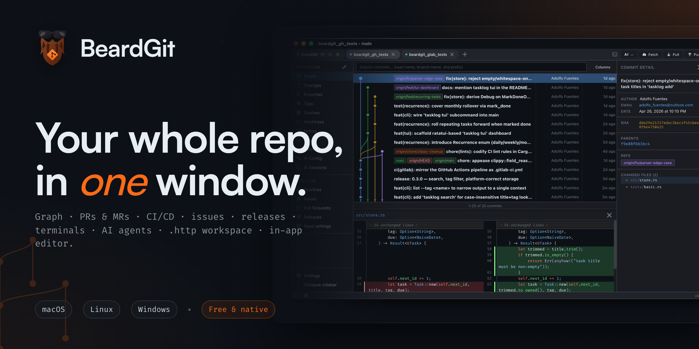
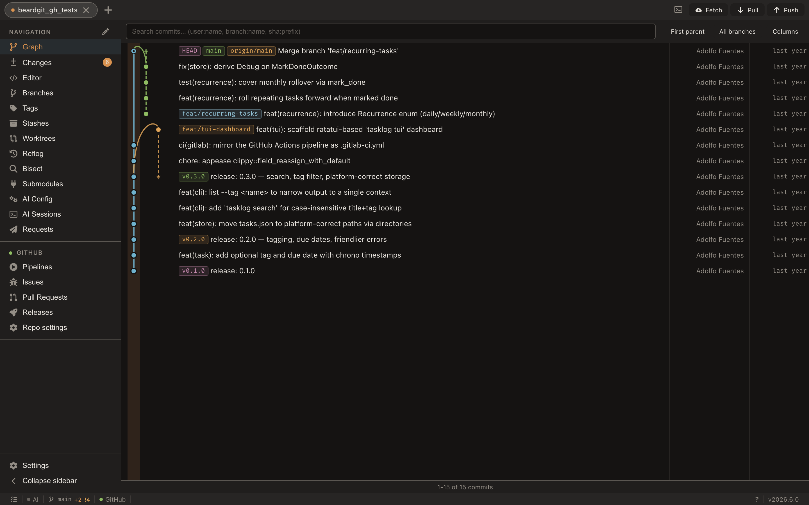
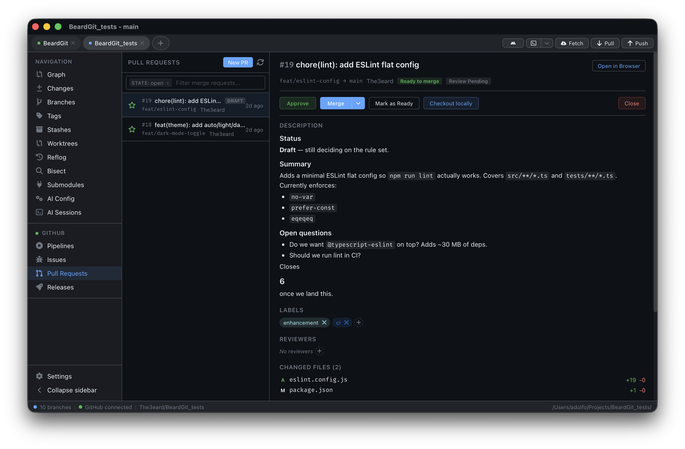
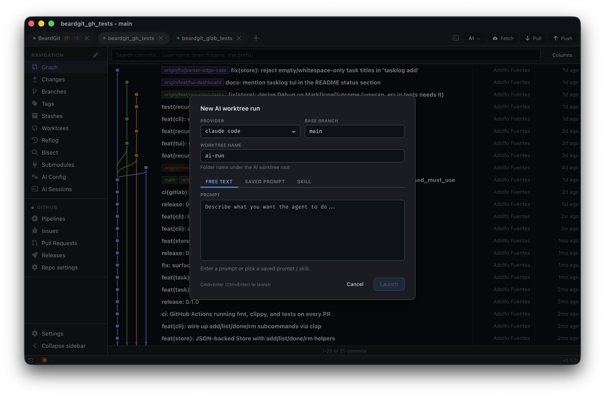
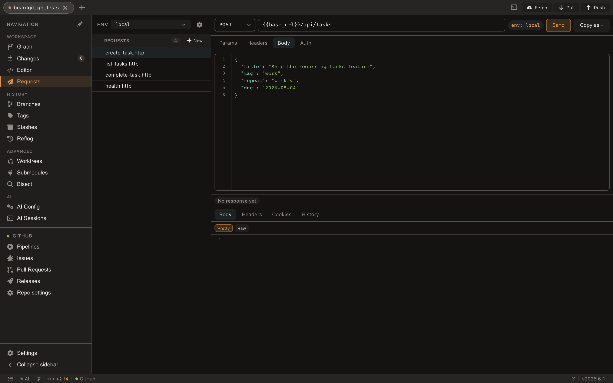
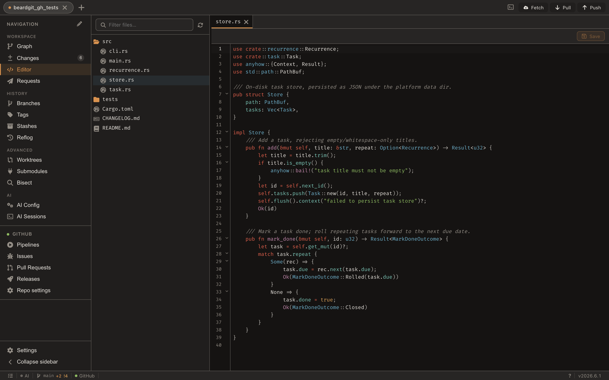

<p align="right">
  <strong>English</strong> · <a href="README.es.md">Español</a>
</p>

<p align="center">
  
</p>

<h1 align="center">BeardGit</h1>

<p align="center">
  <strong>Your whole repo, in one window.</strong>
  <br />
  Stop juggling six tabs to ship a commit. Graph, PRs and MRs, issues, CI/CD pipelines, releases, terminals, AI agents, an in-repo <code>.http</code> workspace, and an in-app code editor — in a single native desktop app.
  <br />
  No Electron. No telemetry. macOS · Linux · Windows.
</p>

<p align="center">
  <a href="https://github.com/The3eard/BeardGit/releases/latest"></a>
  <a href="LICENSE.md"></a>
  <a href="https://github.com/The3eard/BeardGit/actions"></a>
  
</p>

<p align="center">
  <a href="https://github.com/The3eard/BeardGit/releases/latest"><strong>Download for macOS, Linux, or Windows ↓</strong></a>
  &nbsp;·&nbsp;
  <a href="https://the3eard.github.io/BeardGit/">Visit the website</a>
  &nbsp;·&nbsp;
  <a href="#who-beardgit-is-for">Is it for me?</a>
</p>

<p align="center">
  <em>If BeardGit saves you a tab, drop a ⭐ — it’s how the project gets seen.</em>
</p>

---

## § 01 — Manifesto

You ship code from **one keyboard**, not seventeen tabs. BeardGit is built on a simple premise: *everything you touch to release a change should live in one app.* Your commit graph. Your branches. Your staging. Your pull requests and merge requests on **GitHub and GitLab**. Your CI pipelines and deploy jobs. Your issues, labels, and releases. Your terminals. Your AI agents. Your **API requests**, committed alongside the code that calls them. Your **repo files**, edited in place. Close the browser tabs. Close the other clients. BeardGit is the **one window** you keep open.

---

## § 02 — What you get

### A canvas graph that scales

<p align="center">
  
</p>

100K+ commits render smoothly via a viewport-sliced renderer. Branch lanes, merge curves, sync-state lines, author highlighting — all on HTML canvas, not DOM. `⌘F` filters by author, message, or ref; the graph re-lays out only for the matches. Three-way merge editor, interactive rebase, revert, amend, reset, cherry-pick, blame, reflog with recovery actions, and a visual `git bisect` with auto-mode that runs your test command at every step.

Pick a folder that isn't a repo yet and BeardGit offers to set it up in one shot: `git init`, drop a `.gitignore`, commit as **Initial commit**, create a matching repo on GitHub or GitLab, wire the remote, and push — every step independently optional, partial progress preserved on failure.

---

### Forge-native for GitHub and GitLab

<p align="center">
  
</p>

Create, edit, merge, approve, and comment on **PRs and MRs** with **per-file diff and inline review threads**. Manage issues, labels, milestones, assignees. Trigger, retry, retry-failed-only, cancel pipelines. Publish releases and stream asset uploads. Edit repo settings — description, homepage, topics, visibility, default branch, branch protection, labels — without leaving the app.

A clean `ForgeProvider` abstraction wraps `gh` and `glab`. Self-hosted **GitHub Enterprise** and **on-prem GitLab** work out of the box; auth is checked per-host so a VPN-only forge doesn't shadow a working one. Multi-instance friendly: a personal `gitlab.com` and a corporate self-hosted GitLab can coexist.

> Both CLIs ship bundled in every installer. No PATH dance, no setup.

---

### AI that runs in a worktree, not in your face

<p align="center">
  
</p>

**Claude Code, Codex, OpenCode** — your local install, driven by BeardGit. Each background run lands on its own `ai/<provider>/<slug>` branch in an isolated worktree under `.beardgit/ai-worktrees/`, queued at a concurrency cap you set. Review, merge, or discard. The transcript stays in-app and survives tab switches; your main checkout stays untouched.

From any tab the active provider can also draft a commit message, review your staged changes, or review a PR — gated on "there's actually something to talk about" so you never get an empty reply.

---

### An `.http` workspace, in your repo

<p align="center">
  
</p>

Your API requests live next to the code that calls them. Plain `.http` files under `.beardgit/requests/`, committed with the rest of the project, so `git pull` shares them with the team. Environments split into commit-safe `_env/<name>.json`; secrets stay encrypted in BeardGit's local credential store, never in git.

When a forge provider is active, seven `forge_*` auto-variables (`forge_token`, `forge_host`, `forge_api_base`, `forge_owner`, `forge_repo`, `forge_branch`, `forge_commit_sha`) are available with zero setup, so hitting the API of the repo you're staring at is one click. JSON syntax highlighting, `{{var}}` autocomplete, **diff between any two responses from history**, and Copy-as cURL / fetch / HTTPie / wget. Cancel actually cancels the in-flight request.

---

### An in-app code editor

<p align="center">
  
</p>

Edit repo files without leaving BeardGit. CodeMirror 6 with per-language snippets (Rust, TS / JS, Python, Go), keyword completion, JSON lint with rules for `package.json` and `tsconfig.json`, inline color pickers in CSS, indent guides, and a gitignore-aware file tree. Save writes to disk; `⇧ Save` also stages it for the next commit. Right-click any file row in Changes, Branches, or Reflog and pick **Open in editor** to jump straight in.

---

### And the rest

- **Multi-repo tabs.** Heavy state (repo, layout, watcher) loads only for the active tab. A dozen open repos cost the same as one. `⌘1…⌘9` jumps between them.
- **Real terminals.** xterm.js + WebGL fed by a native Rust PTY. OSC 7 auto-links a terminal to the matching project tab. Foreground process polling detects when `claude` / `codex` / `opencode` start and updates the tab on the fly.
- **Themes and i18n.** Light, dark, and custom JSON themes — every accent flows from CSS tokens, including the graph. English and Spanish ship via [Paraglide](https://inlang.com/m/gerre34r/library-inlang-paraglideJs); adding a locale is a JSON file.
- **A sidebar that's yours.** Reorder navigation items, hide what you don't use, reset to the default. Layout persists app-wide.
- **Auto-update.** Tauri updater on the stable channel with diagnostics for endpoint and last-check timestamp — so you can tell a 404 apart from a DNS hiccup without leaving the app.
- **Local-only logs.** `tracing` with daily rotation and 7-day auto-purge to a per-platform path. The log path is included in the in-app error dialog; sharing a file is your call, never the app's.

---

## Who BeardGit is for

> Five minutes from download to first commit. No accounts, no logins, no "BeardGit Cloud."

**You'll like it if you:**

- Live on **GitHub *or* GitLab** and want a first-class experience on either — not "GitHub plus a GitLab bolt-on."
- Test APIs against the repo you're staring at and hate context-switching to a separate API client.
- Run **Claude Code / Codex / OpenCode** and want them isolated in worktrees, not loose in your tree.
- Care that your git client doesn't ship a 200 MB Chromium runtime to render a sidebar.
- Want a polished GUI with **Linux as a first-class platform**, not an afterthought.

**You probably won't if you:**

- Live entirely on `git` CLI and `lazygit` — BeardGit is GUI-first.
- Need SVN, Mercurial, Perforce, or self-hosted Bitbucket — not supported.
- Want a paid product with phone support and an enterprise SSO portal — that's not this.

BeardGit is **free and source-available**. The CC BY-NC-SA license blocks reselling BeardGit *itself* — using it commercially in your team is fine.

---

## Install in 30 seconds

Pre-built installers are published on every tagged release:

| Platform | Architecture | Format |
|---|---|---|
| macOS    | Apple Silicon | `.dmg` |
| Linux    | x64           | `.AppImage` |
| Windows  | x64           | `.exe` |

> **[→ Download the latest release](https://github.com/The3eard/BeardGit/releases/latest)**, pick your installer, and run it. `gh` and `glab` are bundled — no extra setup needed.

<details>
<summary><strong>First launch — unsigned builds (one-time setup)</strong></summary>

BeardGit is currently distributed without Apple or Microsoft code-signing certificates, so both operating systems will flag the app the first time you open it. The app is safe; the warnings exist because the binaries are not notarized/signed. You only need to do this once per install.

**macOS — "BeardGit is damaged" / "developer cannot be verified"**

```sh
xattr -dr com.apple.quarantine /Applications/BeardGit.app
```

Or right-click `BeardGit.app` → **Open** → click **Open** in the confirmation, or use **System Settings → Privacy & Security → Open Anyway**.

**Windows — "Windows protected your PC" (SmartScreen)**

Click **More info** → **Run anyway**. The warning won't reappear on the same machine.

</details>

---

<details>
<summary><strong>Building from source</strong></summary>

### Prerequisites

- **Git 2.x+** — required at runtime for write operations.
- **Rust stable** — install via [rustup](https://rustup.rs).
- **Node.js 22+** — install from [nodejs.org](https://nodejs.org).

**macOS**

```sh
xcode-select --install
```

**Linux (Debian / Ubuntu)**

```sh
sudo apt update
sudo apt install libwebkit2gtk-4.1-dev build-essential curl wget file \
  libxdo-dev libssl-dev libayatana-appindicator3-dev librsvg2-dev
```

**Linux (Arch)**

```sh
sudo pacman -S --needed webkit2gtk-4.1 base-devel curl wget file \
  openssl appmenu-gtk-module libappindicator-gtk3 librsvg xdotool
```

**Linux (Fedora)**

```sh
sudo dnf install webkit2gtk4.1-devel openssl-devel curl wget file \
  libappindicator-gtk3-devel librsvg2-devel libxdo-devel
sudo dnf group install "c-development"
```

**Windows**

1. Install [Microsoft C++ Build Tools](https://visualstudio.microsoft.com/visual-cpp-build-tools/) and select **Desktop development with C++**.
2. Install the [WebView2 Runtime](https://developer.microsoft.com/en-us/microsoft-edge/webview2/).

### Build and run

```sh
git clone git@github.com:The3eard/BeardGit.git
cd BeardGit
npm install
npm run tauri dev
```

First build compiles every Rust crate and takes roughly 3–5 minutes. Subsequent runs are fast. Release bundle:

```sh
npm run tauri build
```

</details>

<details>
<summary><strong>Tech stack and architecture</strong></summary>

| Layer | Stack |
|---|---|
| Shell | Tauri 2 with the auto-updater plugin |
| Core | Rust — 18 crates, libgit2, SQLite, `tracing`, `tokio`, `reqwest`, `portable-pty` |
| Frontend | Svelte 5, TypeScript, Canvas 2D, CodeMirror 6, xterm.js + WebGL, Vite, Paraglide 2 |
| Integrations | `gh` and `glab` (bundled), Claude Code, Codex, OpenCode |
| CI | GitHub Actions — `cargo fmt`, `cargo clippy --workspace -D warnings`, `cargo test --workspace`, `svelte-check`, `vitest`, stylelint, eslint |

Three layers with strict boundaries. Only `app-core` depends on Tauri — every other crate is a reusable library.

| Crate | Role |
|---|---|
| `git-engine` | Hybrid git — `git2` for reads, system `git` for writes |
| `graph-builder` | Pure DAG construction and lane assignment |
| `forge-provider` | `ForgeProvider` trait + shared forge types (contract-only) |
| `cli-provider` | `GitHubCli` / `GitLabCli` impls of `ForgeProvider` via `gh` / `glab` |
| `provider` | `CiProvider` trait + CI types + shared HTTP helpers |
| `gitlab-api` / `github-api` | REST implementations of `CiProvider` |
| `ai-provider` | `AiProvider` trait + shared AI types |
| `claude-code` / `codex` / `opencode` | `AiProvider` implementations |
| `auth` | AES-256-GCM encrypted credential store with machine-bound key |
| `storage` | SQLite via rusqlite, JSON config, TOML theme loader, logging |
| `task-runner` | Async task manager with streaming output and cancellation |
| `terminal` | PTY session manager via `portable-pty` with OSC 7 integration |
| `watcher` | Debounced filesystem + AI config + sessions watchers |
| `mutation-events` | Lightweight event bus for cross-feature notifications |
| `requests-runner` / `requests-store` | `.http` parser, executor, and SQLite-backed history |
| `app-core` | 200+ Tauri command handlers, `AppState`, event bridge |

### Branch strategy

| Branch | Purpose |
|---|---|
| `main` | Mirrors the latest stable release. Auto-update endpoint points here. |
| `beta` | Integration branch. Feature/fix branches merge here with `--no-ff`, then `main` is fast-forwarded on release. |

Day-to-day work happens on short-lived branches off `beta` (`feat/<thing>`, `fix/<thing>`, …). Don't batch features on a long-lived branch.

</details>

---

## Contributing

Pull requests welcome. See [CONTRIBUTING.md](CONTRIBUTING.md). All contributors must sign a short CLA before their changes can be merged.

If you find a bug, [open an issue](https://github.com/The3eard/BeardGit/issues). If you're unsure whether something's a bug, a limitation, or an opportunity for a plugin, open it anyway — over-triage beats under-triage.

## Security

See [SECURITY.md](SECURITY.md) for our disclosure policy.

## License

[CC BY-NC-SA 4.0](LICENSE.md). Free for non-commercial use with attribution and share-alike. Commercial use of the app by individuals or teams is fine — the NC clause is defensive (it blocks reselling BeardGit itself).

---

<p align="center">
  Made with <code>cargo</code>, coffee, and stubbornness by <a href="https://github.com/The3eard">Adolfo Fuentes</a>.
  <br />
  <sub>If BeardGit saves you a tab, drop a ⭐ on the repo — it's how the project gets seen.</sub>
</p>
